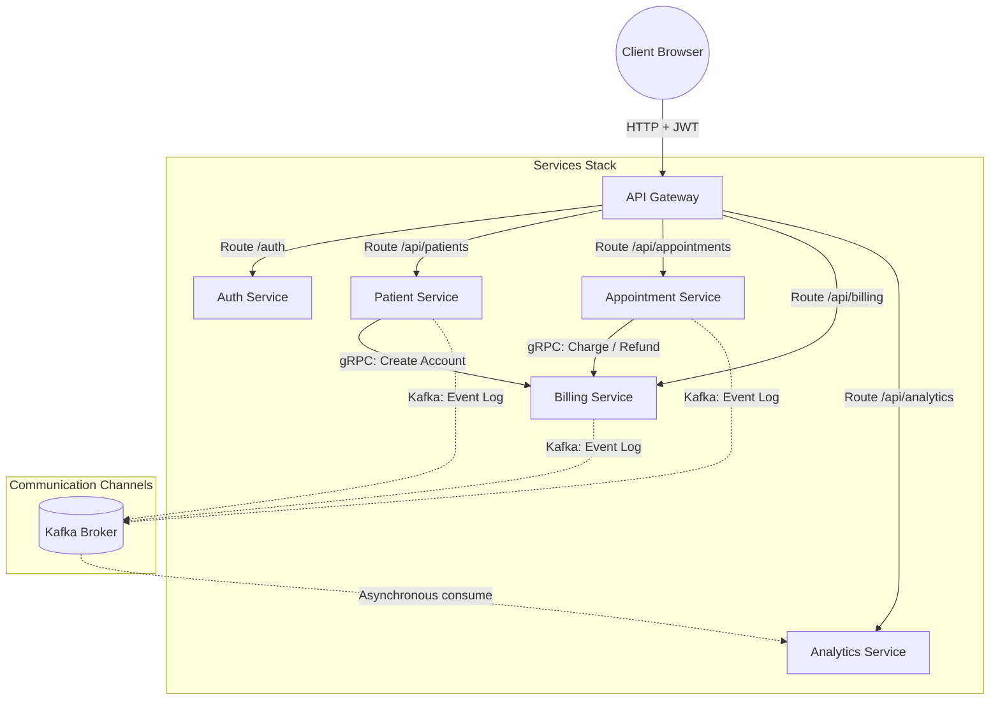

# System Architecture & Business Design - Patient Management System

This document provides a comprehensive overview of the Unified Patient-Care Pathway platform: the core business problems it solves, the architecture, domain logic, and role mappings.

---

## 1. Problem Statement

In legacy healthcare IT architectures, clinical scheduling, patient intake, and financial billing systems are traditionally developed and deployed in silos:

1. **Intake and Billing Synchronization Gaps**: When a patient is registered, staff must manually transcribe demographic records into a separate billing engine. This delay results in out-of-sync profiles, billing errors, and uncollected revenue.
2. **Scheduling Overlaps**: Medical staff manually verify calendars. Lacking duration-aware conflict checks, doctors are double-booked and patient times overlap.
3. **Billing Errors on Schedule Modifications**: When an appointment is rescheduled, canceled, or the fee changes, the ledger is manually corrected. This leads to pricing mistakes, delayed refunds, and auditing headaches.
4. **Weak Access Security**: Administrative portals, physician schedule systems, and patient dashboards are often exposed without granular boundary security, risking HIPAA or GDPR compliance issues.

---

## 2. The Solution: Unified Patient-Care Pathway

This system connects patients, receptionists, and physicians through an automated, event-driven microservices architecture:



### 2.1 Automated Intake-to-Billing Provisioning
* When a receptionist registers a new patient in the `patient-service`, the service automatically calls the `billing-service` via high-speed, secure gRPC.
* A zero-balance billing account is established immediately, locking profile data (email and name) in place.

### 2.2 Intelligent Conflict Prevention
* The scheduler computes calendar spaces mathematically using both start times and duration lengths:
  $$\text{Overlap} \iff (\text{newStart} < \text{existingEnd}) \land (\text{existingStart} < \text{newEnd})$$
* This prevents scheduling overlaps for both the doctor and the patient, returning a detailed `400 Bad Request` if a collision occurs.

### 2.3 Automated Financial Transactions
* **On Creation**: Charging the appointment fee is done synchronously when the receptionist books the appointment.
* **On Update**: Changing the appointment fee computes the difference. If the new fee is higher, the system charges the delta; if lower, it issues a partial credit.
* **On Deletion**: Deleting/canceling the appointment issues a 100% refund.

---

## 3. Microservice Roles & Domain Scopes

The system is comprised of 5 backend microservices and support infrastructure:

| Component | Port | Technology | Scope |
| :--- | :--- | :--- | :--- |
| **`api-gateway`** | `4007` | Spring Cloud Gateway | Entrypoint. Performs JWT signature validation and role authentication. |
| **`auth-service`** | `4005` | Spring Boot + Security | Identity provider. Signs JWTs, processes doctor signup, and exposes validation. |
| **`patient-service`** | `4000` | Spring Boot + JPA | Patient database. Triggers gRPC billing account provisioning. |
| **`appointment-service`** | `4006` | Spring Boot + JPA | Appointment lifecycle management and duration-based scheduling validation. |
| **`billing-service`** | `4002` | Spring Boot + gRPC | Handles balance ledgers, credits, charges, and refunds. |
| **`analytics-service`** | `4004` | Spring Boot + Kafka | Asynchronously consumes messaging topics to store metric analytics. |

---

## 4. Role-Based Access Control (RBAC) Matrix

To secure boundaries, the system uses Gateway-level JWT validation to evaluate the user's role before forwarding requests:

* **`ADMIN`**: Full permissions across all systems. The only role permitted to manage accounts (`/api/users/**`) and system analytics logs (`/api/analytics/**`).
* **`RECEPTIONIST`**: Can perform patient intake, billing edits, and schedule appointments. Blocked from analytics and user onboarding.
* **`PHYSICIAN`**: Assigned to registered doctors. Can view assigned appointments and read patient profiles.
* **`USER`** (Patient): Allowed access to read their own patient profile, view personal appointments, and retrieve their billing account statements.

---

## 5. Deployment and Orchestration

The entire platform is configured to run out-of-the-box using Docker Compose.

```bash
# Build images and start all containers
docker compose up --build -d
```

### Infrastructure Components:
* **Kafka (`port 9092`)**: Distributes audit logs and metrics asynchronously.
* **Elasticsearch, Logstash, Kibana (ELK)**: Ingests, indexes, and visualizes service log outputs.
* **Dedicated PostgreSQL Databases**: Every service maintains its own isolated database container to preserve microservice data autonomy:
  * `patient-service-db`
  * `auth-service-db`
  * `billing-service-db`
  * `appointment-service-db`
  * `analytics-service-db`
