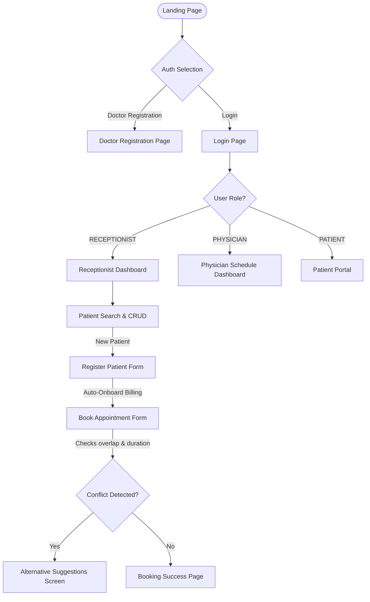

# Unified Patient-Care Pathway - Frontend Flow Wireframes & API Mapping

This document serves as the design specification and API bridge for developers building the user interface of the Patient Management System.

---

## 1. Business Use Case: Doctor-Patient Care Bridge

The platform operates as a secure digital bridge connecting patients, receptionists, and physicians:
1. **Physicians** register their credentials and professional profiles (name, specialization, contact) autonomously.
2. **Receptionists** intake patients, record demographic details (which automatically sets up a zero-balance billing account), search for available doctors, and assign patients to doctors via duration-based, overlap-free appointments.
3. **Patients** log in to view their health schedule and keep track of their billing/invoices.

---

## 2. Navigation Flow Chart



---

## 3. Detailed Flow Wireframes & API Mapping

### Flow 1: Doctor Self-Registration
Allows new physicians to register themselves and their practice profile simultaneously.

#### Screen Wireframe
```
┌────────────────────────────────────────────────────────┐
│  PHYSICIAN SELF-REGISTRATION                           │
├────────────────────────────────────────────────────────┤
│                                                        │
│  Full Name:      [ Dr. Sarah Connor          ]         │
│  Specialization: [ Cardiologist              ]         │
│  Email Address:  [ sarah.c@hospital.org      ]         │
│  Phone Number:   [ +1-555-0192               ]         │
│  Password:       [ ****************          ]         │
│  Confirm Pass:   [ ****************          ]         │
│                                                        │
│                     [ REGISTER & CREATE PROFILE ]      │
│                                                        │
└────────────────────────────────────────────────────────┘
```

#### API Sequences & Payloads
1. **Submit Registration**
   - **Endpoint**: `POST http://localhost:4007/auth/register-doctor`
   - **Headers**: `Content-Type: application/json`
   - **Request Body**:
     ```json
     {
       "name": "Dr. Sarah Connor",
       "specialization": "Cardiologist",
       "email": "sarah.c@hospital.org",
       "password": "password123",
       "phone": "+1-555-0192"
     }
     ```
   - **Response (201 Created)**:
     ```json
     {
       "id": "76db9e57-bb03-49d6-953e-ea6bcf36a54f",
       "name": "Dr. Sarah Connor",
       "specialization": "Cardiologist",
       "email": "sarah.c@hospital.org",
       "phone": "+1-555-0192",
       "userId": "d7bcf054-d8bc-4672-8ee6-857cb3e0e755"
     }
     ```

2. **Login to Access Schedule**
   - **Endpoint**: `POST http://localhost:4007/auth/login`
   - **Request Body**:
     ```json
     {
       "email": "sarah.c@hospital.org",
       "password": "password123"
     }
     ```
   - **Response (200 OK)**:
     ```json
     {
       "token": "eyJhbGciOiJIUzI1NiIsInR5cCI6IkpXVCJ9..."
     }
     ```

---

### Flow 2: Receptionist Patient Intake & Doctor Assignment
Receptionists handle the intake of patients and assign them to doctors by scheduling appointments.

#### Screen 1: Receptionist Patient Intake Form
```
┌────────────────────────────────────────────────────────┐
│  RECEPTIONIST PORTAL - REGISTER NEW PATIENT            │
├────────────────────────────────────────────────────────┤
│                                                        │
│  Patient Name:   [ Jane Doe                  ]         │
│  Email Address:  [ jane.doe@example.com      ]         │
│  Home Address:   [ 742 Evergreen Terrace     ]         │
│  Date of Birth:  [ 1992-04-24                ]         │
│                                                        │
│                        [ INTAKE & CREATE BILLING ]     │
│                                                        │
└────────────────────────────────────────────────────────┘
```

#### API Sequences & Payloads (Patient Registration)
1. **Intake Patient**
   - **Endpoint**: `POST http://localhost:4007/api/patients`
   - **Headers**: `Authorization: Bearer <token>`, `Content-Type: application/json`
   - **Request Body**:
     ```json
     {
       "name": "Jane Doe",
       "email": "jane.doe@example.com",
       "address": "742 Evergreen Terrace",
       "dateOfBirth": "1992-04-24",
       "registeredDate": "2026-05-26"
     }
     ```
   - **Response (201 Created)**:
     ```json
     {
       "id": "bc2b3cf4-8395-46ee-8199-6e3e5898863f",
       "name": "Jane Doe",
       "email": "jane.doe@example.com",
       "address": "742 Evergreen Terrace",
       "dateOfBirth": "1992-04-24",
       "registeredDate": "2026-05-26"
     }
     ```
     *(Note: patient-service automatically invokes billing-service via gRPC to establish a Patient Billing Account).*

---

### Flow 3: Intelligent Scheduling & Conflict Resolution
Receptionist schedules an appointment for a patient with a doctor while specifying a duration.

#### Screen 2: Appointment Scheduler
```
┌────────────────────────────────────────────────────────┐
│  SCHEDULE APPOINTMENT                                  │
├────────────────────────────────────────────────────────┤
│                                                        │
│  Patient:       Jane Doe [Selected]                    │
│  Physician:     [ Select Doctor ▼ ]                    │
│                 | Dr. Sarah Connor (Cardiologist)      |
│                                                        │
│  Date & Time:   [ 2026-06-01 ] [ 10:00 ] (YYYY-MM-DD)  │
│  Duration:      [ 45 ] Minutes                         │
│  Fee:           $ [ 150.00 ]                           │
│  Notes:         [ Checkup for chest pain     ]         │
│                                                        │
│                     [ VERIFY & BOOK APPOINTMENT ]      │
│                                                        │
└────────────────────────────────────────────────────────┘
```

#### Screen 3: Conflict Alert & Resolution (Triggered on Overlap)
If the physician (doctor) or the patient has another appointment overlapping with the selected duration interval:
```
┌────────────────────────────────────────────────────────┐
│  ⚠️ SCHEDULING CONFLICT DETECTED                       │
├────────────────────────────────────────────────────────┤
│                                                        │
│  Dr. Sarah Connor already has an overlapping           │
│  appointment:                                          │
│  - Time: 09:45 AM - 10:15 AM (Duration: 30m)           │
│                                                        │
│  Alternative Suggestions for June 01, 2026:            │
│  [ Select 09:00 AM - 09:45 AM ]                        │
│  [ Select 10:15 AM - 11:00 AM ]                        │
│                                                        │
│                  [ ADJUST TIME ]     [ FORCE CANCEL ]  │
│                                                        │
└────────────────────────────────────────────────────────┘
```

#### API Sequences & Payloads (Appointment Booking)
1. **Submit Appointment Request**
   - **Endpoint**: `POST http://localhost:4007/api/appointments`
   - **Headers**: `Authorization: Bearer <token>`, `Content-Type: application/json`
   - **Request Body**:
     ```json
     {
       "patientId": "bc2b3cf4-8395-46ee-8199-6e3e5898863f",
       "userId": "d7bcf054-d8bc-4672-8ee6-857cb3e0e755",
       "appointmentDateTime": "2026-06-01T10:00:00",
       "durationMinutes": 45,
       "appointmentFee": 150.00,
       "status": "SCHEDULED",
       "notes": "Checkup for chest pain"
     }
     ```
   
2. **Conflict Response (400 Bad Request)**
   If a conflict exists, the backend returns:
   - **Status Code**: `400 Bad Request`
   - **Response Body**:
     ```json
     {
       "timestamp": "2026-05-26T11:42:00.000+00:00",
       "status": 400,
       "error": "Bad Request",
       "message": "Physician already has an overlapping appointment between 2026-06-01T09:45:00 and 2026-06-01T10:15:00",
       "path": "/appointments"
     }
     ```

3. **Success Response (201 Created)**
   If no conflict exists, the appointment is created and billing is charged:
   - **Response Body**:
     ```json
     {
       "id": "3b29c0d5-5bc4-47ef-a0f5-568b6cf2e3a0",
       "patientId": "bc2b3cf4-8395-46ee-8199-6e3e5898863f",
       "userId": "d7bcf054-d8bc-4672-8ee6-857cb3e0e755",
       "billingAccountId": "BILL-29384",
       "appointmentFee": 150.00,
       "appointmentDateTime": "2026-06-01T10:15:00",
       "durationMinutes": 45,
       "status": "SCHEDULED",
       "notes": "Checkup for chest pain",
       "createdAt": "2026-05-26T11:42:05.129",
       "updatedAt": "2026-05-26T11:42:05.129"
     }
     ```

---

### Flow 4: Admin Dashboard & Activity Monitoring
Allows administrators to monitor system events, analyze traffic metrics, and onboard administrative staff (receptionists).

#### Screen 1: Admin Stats & System Activity Log
```
┌────────────────────────────────────────────────────────┐
│  ADMIN DASHBOARD - SYSTEM MONITORING                   │
├────────────────────────────────────────────────────────┤
│  [ SYSTEM SUMMARY METRICS ]                            │
│  Total Events: [ 1,482 ]   Active Patient Accounts: 98│
│  Appointments Scheduled: [ 430 ]  Billing Account Vol: 98│
├────────────────────────────────────────────────────────┤
│  [ REAL-TIME AUDIT LOG ]                               │
│  - [14:42:01] APPOINTMENT_CREATED (Patient: Jane Doe)  │
│  - [14:38:15] PATIENT_CREATED     (Intake: John Smith) │
│  - [14:35:10] BILLING_ACCOUNT_CREDITED (Amount: $100.0)│
├────────────────────────────────────────────────────────┤
│  Actions:  [ ONBOARD RECEPTIONIST ]  [ BROWSE USERS ]  │
└────────────────────────────────────────────────────────┘
```

#### Screen 2: Onboard Receptionist / Staff Form
```
┌────────────────────────────────────────────────────────┐
│  ADMIN DASHBOARD - CREATE STAFF ACCOUNT                │
├────────────────────────────────────────────────────────┤
│                                                        │
│  Email Address:  [ staff.receptionist@hospital.org ]   │
│  Initial Pass:   [ ****************                ]   │
│  System Role:    [ RECEPTIONIST                    ▼ ]   │
│                                                        │
│                         [ CREATE STAFF ACCOUNT ]       │
│                                                        │
└────────────────────────────────────────────────────────┘
```

#### API Sequences & Payloads (Admin Portal)
1. **Fetch Summary Metrics**
   - **Endpoint**: `GET http://localhost:4007/api/analytics/summary`
   - **Headers**: `Authorization: Bearer <ADMIN_TOKEN>`
   - **Response (200 OK)**:
     ```json
     {
       "totalEvents": 1482,
       "eventCounts": {
         "PATIENT_CREATED": 98,
         "APPOINTMENT_CREATED": 430,
         "BILLING_ACCOUNT_CREATED": 98
       }
     }
     ```

2. **Fetch Audit Event logs**
   - **Endpoint**: `GET http://localhost:4007/api/analytics`
   - **Headers**: `Authorization: Bearer <ADMIN_TOKEN>`
   - **Response (200 OK)**:
     ```json
     [
       {
         "id": "c8db9e57-bb03-49d6-953e-ea6bcf36a89a",
         "eventType": "APPOINTMENT_CREATED",
         "patientId": "bc2b3cf4-8395-46ee-8199-6e3e5898863f",
         "eventDateTime": "2026-05-26T14:42:01.000",
         "description": "Event triggered on booking appointment"
       }
     ]
     ```

3. **Onboard Staff User**
   - **Endpoint**: `POST http://localhost:4007/api/users`
   - **Headers**: `Authorization: Bearer <ADMIN_TOKEN>`, `Content-Type: application/json`
   - **Request Body**:
     ```json
     {
       "email": "staff.receptionist@hospital.org",
       "password": "securepassword123",
       "role": "RECEPTIONIST"
     }
     ```
   - **Response (200 OK)**:
     ```json
     {
       "id": "18ac2b3c-8395-46ee-8199-6e3e58988abc",
       "email": "staff.receptionist@hospital.org",
       "role": "RECEPTIONIST"
     }
     ```
