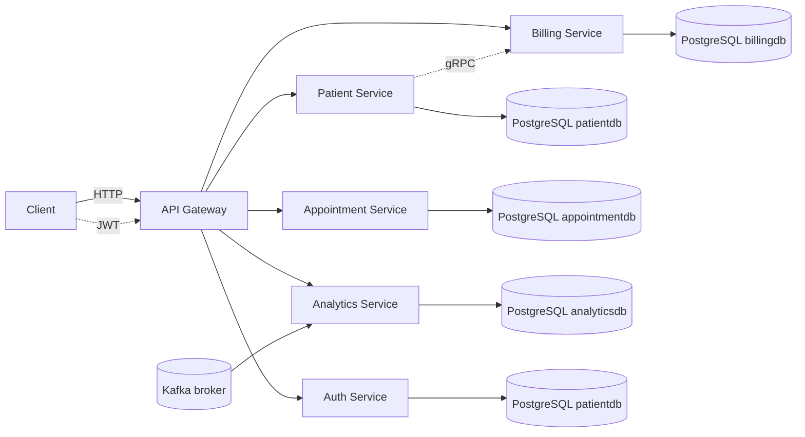

# Patient Management System Microservice Platform

## Overview

This repository contains a Java 21 Spring Boot microservices platform for a healthcare-style patient management system.
It demonstrates a complete backend flow using:
- API gateway routing
- JWT authentication
- PostgreSQL-backed service databases
- gRPC service-to-service communication
- Kafka analytics ingestion
- Docker Compose container orchestration

## What this project shows

- Modern service separation with independent data stores
- External requests through a Spring Cloud Gateway
- Authenticated API access with JWT validation
- Patient lifecycle management linked to billing and appointments
- Billing account creation and automatic appointment charge/refund logic
- Kafka-based analytics event processing

## Services

- **api-gateway** — public entrypoint and route proxy
- **auth-service** — JWT authentication, user management, token validation
- **patient-service** — patient CRUD, onboarding, and billing account creation via gRPC
- **billing-service** — billing account CRUD, charge/credit operations, gRPC API
- **appointment-service** — appointment lifecycle, appointment fees, and billing adjustments
- **analytics-service** — Kafka consumer that persists analytics events
- **kafka** — message broker for analytics events
- **PostgreSQL** — dedicated DB containers for each service

## Architecture and data flow

1. Client requests enter through the **API gateway** at `localhost:4007`.
2. The gateway routes requests to downstream services and enforces JWT authorization.
3. The **auth-service** issues JWT tokens and validates requests.
4. The **patient-service** manages patient records and creates billing accounts over gRPC.
5. The **appointment-service** handles appointment creation, update, and deletion, then charges or refunds billing accounts.
6. The **billing-service** stores billing accounts and exposes both REST and gRPC access.
7. The **analytics-service** consumes Kafka events and saves analytics data.

## Technology stack

| Layer            | Technology                |
|------------------|---------------------------|
| Language         | Java 21                   |
| Framework        | Spring Boot 4             |
| Gateway          | Spring Cloud Gateway      |
| Persistence      | Spring Data JPA           |
| Messaging        | Spring Kafka              |
| Database         | PostgreSQL                |
| RPC              | gRPC / Protocol Buffers   |
| Containerization | Docker / Docker Compose   |

## Service ports

- `api-gateway` — `4007`
- `patient-service` — `4000`
- `auth-service` — `4005`
- `billing-service` — `4002`
- `appointment-service` — `4006`
- `analytics-service` — `4004`
- `kafka` — `9092`

## API Gateway routing

### Auth
- `POST /auth/login` → `auth-service`
- `POST /auth/users` → `auth-service`
- `GET /api-docs/auth` → `auth-service` OpenAPI docs

### Patient
- `GET /api/patients/**` → `patient-service`

### Billing
- `GET /api/billing/**` → `billing-service` rewritten to `/billing-accounts/**`
- `POST /api/billing/{id}/credit` → billing credit endpoint
- `POST /api/billing/{id}/charge` → billing charge endpoint

### Appointment
- `GET /api/appointments/**` → `appointment-service`
- `POST /api/appointments` → `appointment-service`

### Analytics
- `GET /api/analytics/**` → `analytics-service` rewritten to `/analytics-events/**`

### API docs
- `GET /api-docs/patients` → `patient-service`
- `GET /api-docs/billing` → `billing-service`
- `GET /api-docs/analytics` → `analytics-service`
- `GET /api-docs/appointments` → `appointment-service`

## Persistence

Each service has its own PostgreSQL database container:

- `patient-service-db` → `patientdb`
- `auth-service-db` → `patientdb`
- `billing-service-db` → `billingdb`
- `appointment-service-db` → `appointmentdb`
- `analytics-service-db` → `analyticsdb`

All databases use `admin_viewer` / `password` for service connectivity. This keeps each service data isolated while still allowing independent startup and migration.

## Business flow

- Patient creation triggers a gRPC call from `patient-service` to `billing-service` to create a billing account.
- Appointment creation charges the billing account automatically.
- Appointment updates compare the previous fee and apply a charge or credit for the difference.
- Appointment deletion refunds the full appointment fee back to billing.
- Analytics events can be produced and consumed via Kafka to verify event-driven behavior.

## Run locally

From the repository root:

```bash
docker compose up --build
```

That starts:
- all backend services
- 5 PostgreSQL containers
- Kafka broker
- API gateway

## Local URLs

- API gateway: `http://localhost:4007`
- Billing service: `http://localhost:4002`
- Analytics service: `http://localhost:4004`
- Auth service: `http://localhost:4005`
- Patient service: `http://localhost:4000`
- Appointment service: `http://localhost:4006`

## Quick test flow

1. Create a user via `POST http://localhost:4007/auth/users`
2. Log in via `POST http://localhost:4007/auth/login`
3. Create a patient via `POST http://localhost:4007/api/patients`
4. Create an appointment via `POST http://localhost:4007/api/appointments`
5. Verify billing and appointment state via GET endpoints
6. Update or delete the appointment to confirm billing adjustments

## Why this setup matters

- Demonstrates a real microservices architecture with independent state
- Shows JWT-secured gateway routing and API rewriting
- Uses gRPC for internal service interactions and PostgreSQL for persistence
- Illustrates billing automation tied to appointment lifecycle
- Includes event-driven analytics with Kafka and separate persistence

## Implementation highlights

- `api-gateway` routes external requests and applies JWT validation filters
- `auth-service` provides user management and token issuance
- `patient-service` handles patient CRUD and billing onboarding via gRPC
- `billing-service` exposes REST + gRPC billing operations and maintains account state
- `appointment-service` applies billing logic for fees, updates, and refunds
- `analytics-service` consumes Kafka events and stores analytics records

## Deployment notes

Use Docker Compose for the full stack:

```bash
docker compose up --build
```

If you prefer to run services individually for development:

```bash
cd billing-service
./mvnw spring-boot:run
```

Environment variables for each service include:
- `SPRING_DATASOURCE_URL`
- `SPRING_DATASOURCE_USERNAME`
- `SPRING_DATASOURCE_PASSWORD`
- `SPRING_JPA_HIBERNATE_DDL_AUTO`
- `SPRING_KAFKA_BOOTSTRAP_SERVERS`
- `JWT_SECRET` for `auth-service`

### Recommended start order

1. PostgreSQL databases
2. Kafka broker
3. `auth-service`
4. `billing-service`
5. `patient-service`
6. `appointment-service`
7. `analytics-service`
8. `api-gateway`

## Architecture diagram



## Project structure

- `api-gateway/` — gateway configuration and route rules
- `auth-service/` — authentication and user management
- `patient-service/` — patient domain and billing onboarding
- `billing-service/` — billing account management and gRPC API
- `appointment-service/` — appointment lifecycle and billing automation
- `analytics-service/` — Kafka analytics ingestion and persistence
- `docker-compose.yml` — full-stack orchestration
