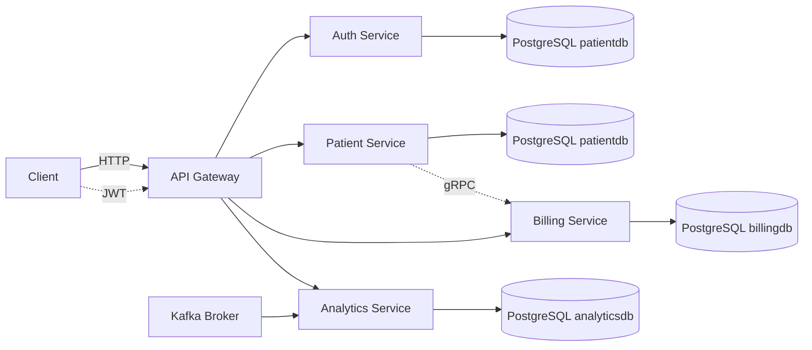
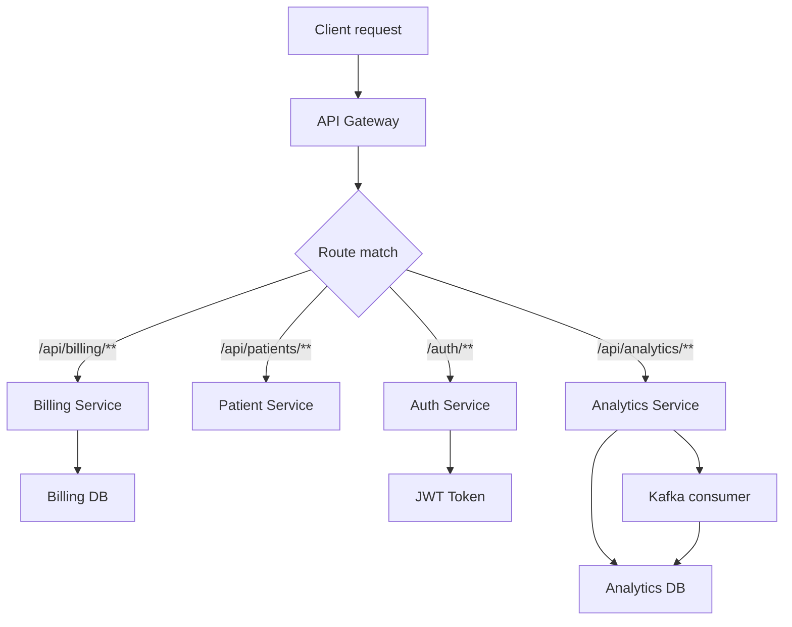

# PMS2 Microservice Platform

## Patient Management System

It is a modern Spring Boot microservice platform built as a healthcare / patient management demo.
It is designed to show a complete microservice flow with API gateway routing, authentication, PostgreSQL persistence, Kafka event ingestion, and service-to-service communication.

## Salient Features

- Fully containerized multi-service architecture
- API gateway with route rewriting and JWT validation
- Dedicated PostgreSQL database per service
- Kafka-driven analytics ingestion
- Service-level unit tests and Spring Boot test support

## Services

- **api-gateway** — Spring Cloud Gateway entry point for HTTP traffic
- **auth-service** — JWT-based authentication and token management
- **patient-service** — patient profile CRUD and domain data
- **billing-service** — billing account CRUD backed by PostgreSQL
- **analytics-service** — Kafka consumer for analytics events + PostgreSQL persistence
- **kafka** — message broker for event-driven analytics
- **PostgreSQL** — separate DB containers for patient, auth, billing, and analytics

## Architecture and flow

1. Client requests enter through the **API gateway** at `localhost:4007`.
2. The gateway routes requests to downstream services according to path rules.
3. Protected APIs require JWT validation via gateway filters.
4. The **auth-service** issues JWT tokens for authenticated users.
5. The **patient-service** manages patient records.
6. The **billing-service** stores billing accounts in `billingdb`.
7. The **analytics-service** consumes Kafka messages from the `patient` topic, parses protobuf `PatientEvent` payloads, and stores analytics records in `analyticsdb`.

## Technology stack

| Layer            | Technology.             |
|------------------|-------------------------|
| Language         | Java 21                 |
| Web framework    | Spring Boot 4           |
| API gateway      | Spring Cloud Gateway    |
| Persistence      | Spring Data JPA         |
| Messaging.       | Spring Kafka            |
| Database         | PostgreSQL              |
| Test DB          | H2 in-memory            |
| Serialization    | Protocol Buffers / gRPC |
| Containerization | Docker / Docker Compose |

## Service ports

- `api-gateway`: `4007`
- `patient-service`: `4000`
- `auth-service`: `4005`
- `billing-service`: `4002`
- `analytics-service`: `4004`
- `kafka`: `9092`

## API Gateway routing

### Auth
- `POST /auth/**` → `auth-service`
- `GET /api-docs/auth` → `auth-service` OpenAPI docs

### Patient
- `GET /api/patients/**` → `patient-service`

### Billing
- `GET /api/billing/**` → `billing-service` rewritten to `/billing-accounts/**`

### Analytics
- `GET /api/analytics/**` → `analytics-service` rewritten to `/analytics-events/**`

### API docs
- `GET /api-docs/patients` → `patient-service`
- `GET /api-docs/billing` → `billing-service`
- `GET /api-docs/analytics` → `analytics-service`

## Data persistence

Each stateful service has its own PostgreSQL database container:

- `patient-service-db` → `patientdb`
- `auth-service-db` → `patientdb`
- `billing-service-db` → `billingdb`
- `analytics-service-db` → `analyticsdb`

All databases use a shared service user `admin_viewer` with password `password`, but each service is isolated into its own database.

## 📡 Analytics event flow

- The `analytics-service` listens to Kafka topic `patient`.
- Incoming messages are protobuf-encoded `PatientEvent` records.
- The service deserializes the event, maps the payload into analytics data, and saves it to PostgreSQL.

## 🧪 Testing

This repo includes a dedicated test setup for each service and also integration tests


## ▶️ Run locally

From the repository root:

```bash
docker compose up --build
```

This boots:
- 4 Spring Boot microservices
- 4 PostgreSQL containers
- Kafka broker
- API gateway

## 🌍 Local URLs

- API gateway: `http://localhost:4007`
- Billing service: `http://localhost:4002`
- Analytics service: `http://localhost:4004`
- Auth service: `http://localhost:4005`
- Patient service: `http://localhost:4000`

## ✅ Why this setup is useful

- Demonstrates a real microservice routing pattern
- Separates concerns by service boundaries
- Uses Kafka for asynchronous analytics ingestion
- Shows how to wire gateway rewrite rules to controller paths
- Includes a test-friendly setup for CI-style service validation

## �️ Implementation details

- `api-gateway` uses Spring Cloud Gateway routes and rewrite filters to map public `/api/billing/**` and `/api/analytics/**` paths to internal controller paths.
- `auth-service` is a Spring Boot app exposing JWT authentication endpoints and token management.
- `patient-service` exposes patient CRUD APIs and is backed by PostgreSQL via Spring Data JPA.
- `patient-service` also uses a gRPC client (`BillingServiceGrpcClient`) to call `billing-service` for billing account creation during patient onboarding.
- `billing-service` is built with a standard controller-service-repository pattern:
  - `BillingAccountController` handles HTTP endpoints.
  - `BillingAccountService` contains business logic and validation.
  - `BillingAccountRepository` persists `BillingAccount` entities in PostgreSQL.
  - `BillingGrpcService` exposes a gRPC endpoint for inter-service communication.
- `analytics-service` includes:
  - `AnalyticsEventController` for HTTP CRUD.
  - `AnalyticsEventService` for event business logic.
  - `AnalyticsEventRepository` for JPA persistence.
  - `KafkaConsumer` listening on the `patient` topic and converting protobuf `PatientEvent` payloads into analytics records.
- Both billing and analytics services use `spring.datasource.*` environment-based configuration so Docker Compose can point them to their own PostgreSQL containers.
- The analytics service test profile uses H2 in-memory DB and disables Kafka auto-configuration so unit tests are fast and isolated.
## 🚢 Deployment

The easiest deployment path is Docker Compose.

1. From the repository root, build and start all services:

```bash
docker compose up --build
```

2. Confirm the gateway is running at `http://localhost:4007`.
3. If you want to run services individually, use the service folders and Maven:

```bash
cd billing-service
./mvnw spring-boot:run
```

For a production-like environment, deploy each service as a separate container and configure environment variables:

- `SPRING_DATASOURCE_URL`
- `SPRING_DATASOURCE_USERNAME`
- `SPRING_DATASOURCE_PASSWORD`
- `SPRING_JPA_HIBERNATE_DDL_AUTO`
- `SPRING_KAFKA_BOOTSTRAP_SERVERS`
- `JWT_SECRET` for `auth-service`

### Recommended deployment flow

- Start PostgreSQL containers first.
- Start Kafka and ensure the broker is available.
- Start backend services in the order: `auth-service`, `patient-service`, `billing-service`, `analytics-service`.
- Start `api-gateway` last so all routes are available.

## 🧭 Architecture diagram



## 🔄 Flow chart


## �🗂 Project structure

- `api-gateway/` — gateway configuration and route rules
- `auth-service/` — auth logic and JWT token service
- `patient-service/` — patient domain and persistence
- `billing-service/` — billing CRUD and database operations
- `analytics-service/` — Kafka consumer, analytics persistence, tests
- `docker-compose.yml` — orchestration for the full stack
