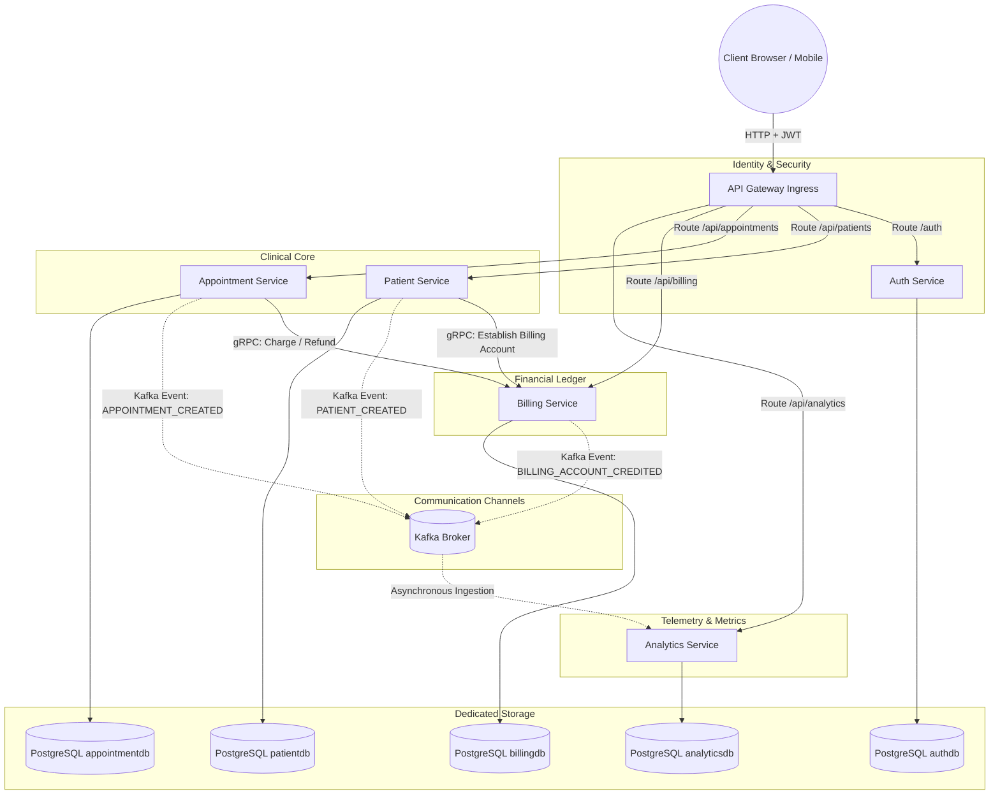

# Unified Patient-Care Pathway (UPCP) Platform
## Enterprise-Grade Microservices Architecture & System Documentation

Welcome to the **Unified Patient-Care Pathway (UPCP) Platform**, a state-of-the-art healthcare operations and financial reconciliation ecosystem. Built with a modern microservices topology, the UPCP platform serves as a high-performance digital bridge connecting Patients, Medical Physicians, Clinic Receptionists, and System Administrators.

This document provides a comprehensive operational, architectural, and technical blueprint of the platform. It is designed for developers, system architects, product managers, and business stakeholders.

---

## 1. Executive Summary & Business Case

### 1.1 The Operational & Financial Chasm in Healthcare IT
In traditional clinical environments, scheduling systems (EHR/EMR), front-office patient intake, and financial billing ledgers are separated into isolated legacy software suites. This siloed approach creates major operational and financial pain points:
1. **Intake-to-Billing Sync Gaps**: Manual transcription of patient demographic files into billing engines delays account creation. Out-of-sync records trigger claims rejection and billing errors.
2. **Resource Scheduling Overlaps**: Simple calendar slots lack multi-dimensional interval checks. Patients get double-booked, and physicians find themselves assigned to multiple rooms simultaneously, causing patient frustration and staff burnout.
3. **Ledger Discrepancies on Schedule Adjustments**: Changing appointment dates, times, durations, or fees requires manual invoicing updates. Legeders are left prone to data entry errors, delayed refunds, or uncollected revenue.
4. **Weak Access & Regulatory Controls**: Clinical data is sensitive (subject to HIPAA/GDPR rules). Exposing administrative panels, clinical charts, and billing ledgers without strict gateway-enforced security boundaries poses severe compliance risks.

### 1.2 The UPCP Strategy: A Single Source of Truth
The **Unified Patient-Care Pathway** addresses these challenges by offering a real-time, event-driven, transaction-aware microservices architecture:

* **Automated Billing Provisioning**: Registration of a patient instantly establishes a secure, zero-balance billing account over gRPC. There is no manual entry, no delay, and zero synchronization mismatch.
* **Intelligent Collision Prevention**: A duration-aware scheduler checks calendar ranges mathematically, preventing overlapping bookings for both the doctor and the patient.
* **Deterministic Financial Ledgers**: Rescheduling or updating appointment fees automatically calculates price differences, charging the delta or issuing credit refunds instantly.
* **Gateway-Enforced Role-Based Access Control (RBAC)**: Centralized JWT validation at the api-gateway strips credentials and propagates secure role/user identities downstream, protecting internal network endpoints.

---

## 2. Platform Architecture & Data Flow

The platform is designed around a **Shared-Nothing Database Pattern** and structured into 5 microservices coordinated via a Spring Cloud API Gateway. 



### 2.1 Communication Paradigms
1. **Synchronous Internal RPC (gRPC)**: Low-latency, strongly typed internal calls verify account existence and execute balance changes synchronously. This ensures that clinical scheduling matches financial ledger states before completing the transaction.
2. **Asynchronous Ingestion (Apache Kafka)**: Event-driven audit tracking broadcasts operations (e.g., `PATIENT_CREATED`, `APPOINTMENT_CREATED`) to an analytics engine without slowing down patient-facing UI responses.
3. **Dedicated Storage (PostgreSQL)**: To guarantee data autonomy, each microservice maintains its own PostgreSQL instance. Cross-service data fetches are performed via REST or gRPC APIs, not DB joins.

---

## 3. What Makes it Production-Grade?

The UPCP platform is engineered to go far beyond a simple MVP (Minimum Viable Product). Below are the salient engineering components that make this system robust, scalable, and enterprise-ready:

### 3.1 Gateway-Level Security & Identity Propagation
Rather than burdening each microservice with the overhead of decoding and validating JWT signatures:
* **Central Ingress Filter**: The `api-gateway` hosts a custom `JwtValidationGatewayFilter` that intercepts requests, checks the JWT signature, and validates that the token is not expired.
* **Header Propagation**: Upon validation, the gateway injects the headers `X-User-Role` and `X-User-Email` before forwarding the request. Downstream services read these headers to identify the caller, simplifying their codebase and preventing token parsing redundancy.
* **Granular RBAC Mapping**: Route rules in the gateway restrict access based on user role.

### 3.2 Advanced Route-Filter Delimiter Engine
Standard Spring Cloud Gateway filters parse arguments by splitting on commas, which breaks if multi-role configurations are configured as comma-separated values (e.g. `ADMIN,PHYSICIAN`).
* **Custom Semicolon Parser**: The UPCP filter supports semicolon-delimited configurations (`JwtValidation=ADMIN;PHYSICIAN`). The Java filter dynamically processes these configurations and splits them using regular expressions `[,;]` to enforce security boundaries without losing configuration properties.

### 3.3 Algorithmic Double-Booking Guard
The scheduling engine validates appointments using start times and duration metrics, ensuring calendar slots do not overlap.
* **Interval Overlap Logic**:
  The system prevents collision for both doctor and patient schedules:
  $$\text{Overlap} \iff (\text{newStart} < \text{existingEnd}) \land (\text{existingStart} < \text{newEnd})$$
  This interval mathematics is executed at the database querying layer using JPA queries to check:
  `appointmentDateTime < existingEndDateTime AND endDateTime > existingAppointmentDateTime`.
* If a conflict is discovered, booking fails immediately and yields a detailed `400 Bad Request` explaining who is unavailable and during what period.

### 3.4 Transactional Billing Automation
The financial adjustments ledger ensures consistent transactions:
* **Rescheduling Adjustment (Delta Calculation)**: If an appointment's fee is updated (e.g., from $100 to $150), the system calculates the delta ($50 charge). If it's lowered (e.g., from $100 to $80), it processes a partial credit ($20 refund).
* **Cancellation Refund**: Deleting an appointment triggers a synchronous gRPC call that refunds 100% of the booking fee back to the patient's billing ledger.

### 3.5 Unified System Logging Pipeline (ELK Stack)
* **Log Ingestion**: Services write structured JSON logs that stream to **Logstash** via a TCP appender on Port `5000`.
* **Central Indexing**: **Elasticsearch** indexes these logs under `microservices-logs`.
* **Visual Dashboards**: **Kibana** enables developers and operations staff to search, filter, and trace log metrics across all microservices using correlation IDs.

### 3.6 Automated API Documentation Aggregator
The API Gateway gathers all service API specifications and exposes them under unified routes. By navigating to the gateway, developers can browse Swagger UI documentation for any microservice instantly.

---

## 4. Role-Based Access Control (RBAC) Matrix

The system maps authentication credentials to four distinct roles, restricting routes at the API Gateway level:

| Target Routes | HTTP Methods | Required Role | Description |
| :--- | :--- | :--- | :--- |
| `/auth/login` | POST | Public | Authenticates credentials and returns a JWT token. |
| `/auth/register-doctor` | POST | Public | Registers a new doctor user and creates their physician profile. |
| `/api/users/**` | ALL | `ADMIN` | Internal user accounts administration (e.g. creating receptionists). |
| `/api/doctors/**` | GET | `ADMIN`, `PHYSICIAN` | Retrieves list of registered physician profiles. |
| `/api/patients/**` | ALL | `ADMIN`, `RECEPTIONIST` | Patient intake, update, list, and removal. |
| `/api/patients/**` | GET | `PHYSICIAN` | Allows doctors to read profiles of patients. |
| `/api/patients/**` | GET | `USER` | Allows a patient to view their own patient profile. |
| `/api/appointments/**` | GET, POST, PUT, DELETE | `ADMIN`, `RECEPTIONIST` | Full clinical calendar scheduling, modification, and cancellation. |
| `/api/appointments/**` | GET | `PHYSICIAN` | Allows doctors to view their personal work schedules. |
| `/api/appointments/**` | GET | `USER` | Allows patients to view their scheduled appointments. |
| `/api/billing/**` | GET, POST | `ADMIN`, `RECEPTIONIST` | Access to billing accounts, ledger details, manual credits/charges. |
| `/api/billing/**` | GET | `PHYSICIAN` | Allows physicians to check patient billing statuses. |
| `/api/billing/**` | GET | `USER` | Allows patients to read their billing account statements. |
| `/api/analytics/**` | ALL | `ADMIN` | Accesses metric data, event counts, and real-time Kafka event audit logs. |

---

## 5. API Reference Manual

The base URL for all external HTTP requests is `http://localhost:4007`. Every authenticated request must carry the header `Authorization: Bearer <JWT_TOKEN>`.

### 5.1 Authentication Service (`auth-service`)

#### Login User
* **Method & Path**: `POST /auth/login`
* **Access**: Public
* **Request Body**:
  ```json
  {
    "email": "admin@example.com",
    "password": "password"
  }
  ```
* **Response (200 OK)**:
  ```json
  {
    "token": "eyJhbGciOiJIUzI1NiIsInR5cCI6IkpXVCJ9.eyJzdWIiOiJhZG1pbkBl..."
  }
  ```

#### Register Doctor
* **Method & Path**: `POST /auth/register-doctor`
* **Access**: Public
* **Request Body**:
  ```json
  {
    "name": "Dr. Emily Stark",
    "specialization": "Neurologist",
    "email": "emily.stark@hospital.org",
    "password": "password123",
    "phone": "+1-555-4039"
  }
  ```
* **Response (201 Created)**:
  ```json
  {
    "id": "a4d3f2c1-bb03-49d6-953e-ea6bcf36a54f",
    "name": "Dr. Emily Stark",
    "specialization": "Neurologist",
    "email": "emily.stark@hospital.org",
    "phone": "+1-555-4039",
    "userId": "e8bcf054-d8bc-4672-8ee6-857cb3e0e999"
  }
  ```

#### Onboard Staff / User (Admin Only)
* **Method & Path**: `POST /api/users`
* **Access**: `ADMIN`
* **Request Body**:
  ```json
  {
    "email": "receptionist.john@hospital.org",
    "password": "securePass789",
    "role": "RECEPTIONIST"
  }
  ```
* **Response (200 OK)**:
  ```json
  {
    "id": "18ac2b3c-8395-46ee-8199-6e3e58988abc",
    "email": "receptionist.john@hospital.org",
    "role": "RECEPTIONIST"
  }
  ```

---

### 5.2 Patient Service (`patient-service`)

#### Create Patient Profile
* **Method & Path**: `POST /api/patients`
* **Access**: `ADMIN`, `RECEPTIONIST`
* **Request Body**:
  ```json
  {
    "name": "Alice Cooper",
    "email": "alice.cooper@mail.com",
    "address": "100 Rock N Roll Way, Detroit, MI",
    "dateOfBirth": "1948-02-04",
    "registeredDate": "2026-05-26"
  }
  ```
* **Response (201 Created)**:
  ```json
  {
    "id": "1c3c9b78-4395-46ee-8199-6e3e58988abc",
    "name": "Alice Cooper",
    "email": "alice.cooper@mail.com",
    "address": "100 Rock N Roll Way, Detroit, MI",
    "dateOfBirth": "1948-02-04",
    "registeredDate": "2026-05-26"
  }
  ```
  *Behind the scenes: Calls the `billing-service` via gRPC to establish a Patient Billing Account matching this ID.*

#### Retrieve Patient List (with Filters)
* **Method & Path**: `GET /api/patients`
* **Access**: `ADMIN`, `RECEPTIONIST`, `PHYSICIAN`
* **Query Parameters**:
  * `name` (Optional) - Filter by matching letters in patient name.
  * `email` (Optional) - Filter by exact match or domain prefix.
* **Response (200 OK)**:
  ```json
  [
    {
      "id": "1c3c9b78-4395-46ee-8199-6e3e58988abc",
      "name": "Alice Cooper",
      "email": "alice.cooper@mail.com",
      "address": "100 Rock N Roll Way, Detroit, MI",
      "dateOfBirth": "1948-02-04",
      "registeredDate": "2026-05-26"
    }
  ]
  ```

---

### 5.3 Appointment Service (`appointment-service`)

#### Book Appointment
* **Method & Path**: `POST /api/appointments`
* **Access**: `ADMIN`, `RECEPTIONIST`
* **Request Body**:
  ```json
  {
    "patientId": "1c3c9b78-4395-46ee-8199-6e3e58988abc",
    "userId": "e8bcf054-d8bc-4672-8ee6-857cb3e0e999",
    "appointmentDateTime": "2026-06-15T09:00:00",
    "durationMinutes": 30,
    "appointmentFee": 120.00,
    "status": "SCHEDULED",
    "notes": "Neurology Initial Screening"
  }
  ```
* **Response (201 Created)**:
  ```json
  {
    "id": "9a29c0d5-5bc4-47ef-a0f5-568b6cf2e777",
    "patientId": "1c3c9b78-4395-46ee-8199-6e3e58988abc",
    "userId": "e8bcf054-d8bc-4672-8ee6-857cb3e0e999",
    "billingAccountId": "BILL-1c3c9b78",
    "appointmentFee": 120.00,
    "appointmentDateTime": "2026-06-15T09:00:00",
    "durationMinutes": 30,
    "status": "SCHEDULED",
    "notes": "Neurology Initial Screening",
    "createdAt": "2026-05-26T15:10:00",
    "updatedAt": "2026-05-26T15:10:00"
  }
  ```

#### Conflict Scenario (400 Bad Request)
If a conflict is detected (doctor or patient is busy at that time range):
* **Response (400 Bad Request)**:
  ```json
  {
    "timestamp": "2026-05-26T15:10:01",
    "status": 400,
    "error": "Bad Request",
    "message": "Physician already has an overlapping appointment between 2026-06-15T09:00:00 and 2026-06-15T09:30:00",
    "path": "/appointments"
  }
  ```

#### Fetch Appointment Directory (with Filters)
* **Method & Path**: `GET /api/appointments`
* **Access**: `ADMIN`, `RECEPTIONIST` (All), `PHYSICIAN` (Filter by own doctor ID), `USER` (Filter by own patient ID)
* **Query Parameters**:
  * `patientId` (Optional) - Return appointments for a specific patient.
  * `userId` (Optional) - Return appointments for a specific doctor.
* **Response (200 OK)**:
  ```json
  [
    {
      "id": "9a29c0d5-5bc4-47ef-a0f5-568b6cf2e777",
      "patientId": "1c3c9b78-4395-46ee-8199-6e3e58988abc",
      "userId": "e8bcf054-d8bc-4672-8ee6-857cb3e0e999",
      "appointmentFee": 120.00,
      "appointmentDateTime": "2026-06-15T09:00:00",
      "durationMinutes": 30,
      "status": "SCHEDULED"
    }
  ]
  ```

#### Cancel Appointment
* **Method & Path**: `DELETE /api/appointments/{id}`
* **Access**: `ADMIN`, `RECEPTIONIST`
* **Response (204 No Content)**
  *Behind the scenes: Automatically communicates over gRPC to issue a $120.00 refund back to Billing.*

---

### 5.4 Billing Service (`billing-service`)

#### Get Billing Ledger (with Filters)
* **Method & Path**: `GET /api/billing`
* **Access**: `ADMIN`, `RECEPTIONIST`, `PHYSICIAN`, `USER`
* **Query Parameters**:
  * `patientId` (Optional) - Restricts ledger records to a single patient's billing account details.
* **Response (200 OK)**:
  ```json
  [
    {
      "id": "BILL-1c3c9b78",
      "patientId": "1c3c9b78-4395-46ee-8199-6e3e58988abc",
      "balance": 0.00,
      "email": "alice.cooper@mail.com",
      "name": "Alice Cooper"
    }
  ]
  ```

#### Post Manual Credit
* **Method & Path**: `POST /api/billing/{id}/credit`
* **Access**: `ADMIN`, `RECEPTIONIST`
* **Request Body**:
  ```json
  {
    "amount": 200.00
  }
  ```
* **Response (200 OK)**:
  ```json
  {
    "id": "BILL-1c3c9b78",
    "patientId": "1c3c9b78-4395-46ee-8199-6e3e58988abc",
    "balance": 200.00
  }
  ```

---

### 5.5 Analytics Service (`analytics-service`)

#### Retrieve Audit Event Logs
* **Method & Path**: `GET /api/analytics`
* **Access**: `ADMIN` (Only)
* **Response (200 OK)**:
  ```json
  [
    {
      "id": "event-uuid-1111",
      "eventType": "PATIENT_CREATED",
      "patientId": "1c3c9b78-4395-46ee-8199-6e3e58988abc",
      "eventDateTime": "2026-05-26T15:00:00",
      "description": "Patient Alice Cooper registered successfully."
    }
  ]
  ```

#### Get Event Volume Aggregation
* **Method & Path**: `GET /api/analytics/summary`
* **Access**: `ADMIN` (Only)
* **Response (200 OK)**:
  ```json
  {
    "totalEvents": 14,
    "eventCounts": {
      "PATIENT_CREATED": 3,
      "APPOINTMENT_CREATED": 8,
      "BILLING_ACCOUNT_CREATED": 3
    }
  }
  ```

---

## 6. Developer & Integration Manual

This section acts as a quick-start guide for developer onboarding, system construction, testing, and extension guidelines.

### 6.1 Prerequisites
Ensure the following development dependencies are installed on the local system:
* **Java**: JDK 21 (Temurin or OpenJDK recommended)
* **Build System**: Maven 3.8+ (or Maven wrapper `./mvnw` bundled in each service folder)
* **Containerization**: Docker Desktop & Docker Compose v2.0+
* **HTTP Client**: Postman, Insomnia, or Curl for endpoint tests.

### 6.2 Running the System Locally

#### The One-Step Compose Command
Execute the following in the repository root folder to build and boot the entire platform (services, DBs, message broker, logging indexer):
```bash
docker compose up --build -d
```
This builds each service's Docker image and spawns the container network.

#### Verifying Container Health
Use `docker ps` to verify all components are running:
* **PostgreSQL DBs**: Exposing host ports `5001` (Patient), `5002` (Auth), `5003` (Analytics), `5004` (Billing), `5005` (Appointment)
* **Kafka**: Port `9092` (internal), `9094` (external)
* **Gateway**: Ingress entrypoint on Port `4007`
* **ELK Stack**: Elasticsearch on Port `9200`, Kibana on Port `5601`

To shut down the cluster and clean volumes:
```bash
docker compose down -v
```

---

### 6.3 Test-Driven Development (TDD) Guide

The platform verifies routing integrity, security boundaries, double-booking calculations, and billing ledger adjustments using integrated Maven test execution.

#### Executing Integration Tests
To run the automated integration test suite:
```bash
cd integration-tests
mvn clean test
```
The test executor boots a local test environment, communicates with the API Gateway, and validates the following conditions:
1. **RBAC Validation**: Validates that an `ADMIN` token can access user audits, while a `PHYSICIAN` or `USER` gets a `403 Forbidden` response.
2. **Conflict Verification**: Attempts to create two appointments overlapping on a single physician. Asserts that the second returns `400 Bad Request` with an overlap error message.
3. **Billing Reconciliation**: Schedules an appointment, updates its cost, and deletes it, confirming the ledger balances are computed correctly at each step.

---

### 6.4 Developer Extension Guidelines

#### Adding a New Secure Downstream Endpoint
1. Open the [application.yml](file:///Users/meena/.gemini/antigravity/scratch/PatientManagementSystem/api-gateway/src/main/resources/application.yml) file.
2. Under `spring.cloud.gateway.routes`, append the new route block:
   ```yaml
   - id: new-clinical-service-route
     uri: http://new-service:4008
     predicates:
       - Path=/api/clinical-records/**
     filters:
       - StripPrefix=1
       - JwtValidation=ADMIN;PHYSICIAN
   ```
3. Set the `JwtValidation` parameter using semicolons matching the permitted roles.

#### Defining New gRPC Methods (Protocol Buffers)
1. Add the proto message configuration in the service `.proto` file (e.g. `billing.proto` located inside the proto source directory).
2. Run `mvn clean compile` to compile and regenerate protobuf Java helper classes.
3. Implement the service endpoints in the service implementation file (e.g. extend `BillingServiceGrpc.BillingServiceImplBase`).

#### Broadcasting a New Kafka Event
1. Define a class mapping the event body (e.g. `NewClinicalEvent`).
2. Inject `KafkaTemplate<String, Object>` into your service.
3. Broadcast the event payload using `kafkaTemplate.send("analytics-topic", event)`.
4. In `analytics-service`, append a listener handler:
   ```java
   @KafkaListener(topics = "analytics-topic", groupId = "analytics-group")
   public void handleNewEvent(NewClinicalEvent event) {
       // Save to analytics DB
   }
   ```

---

## 7. Interactive UI Wireflow Reference

To guide frontend development, the following resources are available:
* **Wireflows**: [FRONTEND_FLOWS.md](file:///Users/meena/.gemini/antigravity/scratch/PatientManagementSystem/FRONTEND_FLOWS.md) specifies the navigation flow chart and API payload sequences mapping the Doctor Registration, Receptionist Intake, Patient Portal, and Conflict Resolution workflows.
* **Layout Layouts**: [WIREFRAMES.md](file:///Users/meena/.gemini/antigravity/scratch/PatientManagementSystem/WIREFRAMES.md) provides detailed ASCII mockup layouts of the screens for Admin, Receptionist, Physician, and Patient dashboards, ready to be translated into CSS/HTML views.
